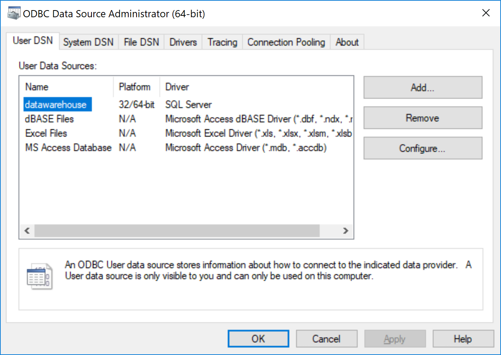
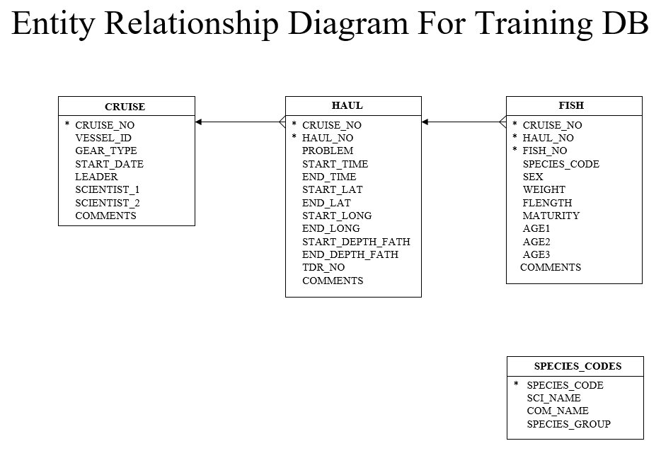

Much of the code here was inspired by and adapted from the [Databases Using R](https://db.rstudio.com/) site from Rstudio.

```{r Setup, echo=F,message=F,error=F,warning=F}
# Install and load pacman (library management package)
if (!require("pacman")) install.packages("pacman")

# Install and load required packages from CRAN ---------------------------------
pacman::p_load(RODBC,DBI,dbplot,dbplyr,dplyr,ggplot2,knitr,RMySQL,
               odbc,parallelMap,R.utils,readr,tidypredict,here,stringr)
# Install packages from github
pacman::p_load_gh("hadley/emo")
```  

# Creating connections
## Create a DSN
You must create a DSN before you can connect before you can connect to the database using R. 

You may configure a User or System DSN on your machine.

  

### In code
You may define your odbc connection in code, like below.  

**This is probably what you want to do if you're distributing code to colleagues with access to the same database, but may have named their User/System DSN something different.**

```{r, echo=T}
# Configure the connection
con.rov <- dbConnect(odbc(), 
                 Driver = "SQL Server", 
                 Server = "161.55.235.187", 
                 Database = "ROV2", 
                 Trusted_Connection = "True")

# Show connection details
con.rov

# Disconnect from database
dbDisconnect(con.rov)
```

Here is an example of how to configure an ODBC connection to an MS Access database (.mdb/.accdb).

**(This is new since my presentation)**

```{r}
con  <- dbConnect(odbc::odbc(), 
                            Driver = "Microsoft Access Driver (*.mdb, *.accdb)", 
                            DBQ = file.path(here("Data/training.accdb")))
```

# Explore the database
The database `training.accdb` is the same database used by Don Pearson's SQL training course at the Santa Cruz laboratory. It is provided in this Git repository.

## Using MS Access
The database **training.accdb** contains three main tables with the following relationships:

* **CRUISE**
* **HAUL** (linked to CRUISE on CRUISE)
* **FISH** (linked to HAUL on HAUL)  



## Using `DBI::dbConnect()`
### Create a connection
`DBI::dbConnect()` creates the connection to the database.  

```{r}
# Define a connection to the Training database located in the Data dir
con <- dbConnect(odbc::odbc(), "training", timeout = 10)
```  

### View the tables (`dbListTables()`) 
Once a connection has been established, use `DBI::dbListTables()` to list the tables in the database.

```{r}
dbListTables(con)
```

### View the tables (Connections pane)  
You can also explore the database and view tables using the Connections pane in Rstudio.

# Querying  
## Using `DBI`  
You may paste SQL code into the `dbGetQuery()` function as a quoted string. `r emo::ji("sunglasses")`

```{r}
dbGetQuery(con, '
  SELECT CRUISE.*
  FROM CRUISE;
')
```

## Using `dplyr`  
You can write your query in `dplyr` syntax and it will be translated into SQL code. `r emo::ji("astonished")`

```{r, echo=T}
# Create query
q1 <- tbl(con, "CRUISE")  

# Show query
show_query(q1)
```

## In an R Notebook code chunk
You can even embed SQL code in an .Rmd chunk. I'm not sure when I'd do that, but... `r emo::ji("man_shrugging")`

```{sql, connection = con, output.var = "sql.df"}
SELECT *
FROM ("CRUISE")
```

```{r, echo = T}
# Print the data frame
sql.df
```

## Create a pointer to a table
The code below creates a pointer to the table `CRUISE`, rather than actually pulling the data into memory.  

This prevents potentially expensive operations in the event of a large table or query.

```{r}
# Create a pointer to the cruise table in the database 
cruise <- tbl(con, "CRUISE")

# Print the table
cruise

# View the details of "cruise"
# View(cruise)
```

## Import data using `collect()`  
To actually retrieve the data, you must use the `collect()` function.   

```{r}
# Collect the cruise data
cruise <- tbl(con, "CRUISE") %>% collect()

# Print the table
cruise

# View the details of "cruise" again
# View(cruise)
```

# Examples
## Summarize cruise leaders  

Who led the most cruises?

### Using `dplyr`

```{r}
# Create the connection
cruise <- tbl(con, "CRUISE")

# Summarize using dplyr
leader.dplyr <- cruise %>% 
  group_by(LEADER) %>% 
  tally() %>% 
  collect() %>% 
  arrange(desc(n))

# Print results
leader.dplyr
```

### Using SQL

```{sql, connection = con, output.var = "leader.sql"}
SELECT CRUISE.LEADER, Count(CRUISE.CRUISE_NO) AS n
FROM CRUISE
GROUP BY CRUISE.LEADER
ORDER BY Count(CRUISE.CRUISE_NO) DESC;
```

```{r}
# Print results
leader.sql
```

## Join tables
Query all rows in `fish`, add `HAUL_NO` and `START_DEPTH_FATH` from `haul`, and add `CRUISE_NO` and `START_DATE` from `cruise`.

### Using `dplyr`

```{r}
# Create database pointers
cruise <- tbl(con, "CRUISE")
haul   <- tbl(con, "HAUL")
fish   <- tbl(con, "FISH")

# Query joined tables
fish.dplyr <-  
  select(fish, SPECIES, SEX, FLENGTH, CRUISE_NO, HAUL_NO) %>% 
  left_join(select(haul, CRUISE_NO, HAUL_NO, START_DEPTH_FATH)) %>% 
  left_join(select(cruise, CRUISE_NO, START_DATE)) %>% 
  collect()
# Print results
fish.dplyr
```

### Using SQL

```{sql, connection = con, output.var = "fish.sql"}
SELECT CRUISE.CRUISE_NO, CRUISE.START_DATE, HAUL.HAUL_NO, HAUL.START_DEPTH_FATH, HAUL.START_TIME, FISH.SPECIES, FISH.SEX, FISH.FLENGTH
FROM CRUISE, HAUL, FISH
WHERE (((CRUISE.CRUISE_NO)=[HAUL].[CRUISE_NO]) AND ((HAUL.HAUL_NO)=[FISH].[HAUL_NO]) AND ((HAUL.CRUISE_NO)=[FISH].[CRUISE_NO]));
```

```{r}
# Print results
fish.sql
```

## Plot haul duration histogram  
Create a histogram of haul durations directly from the database.

```{r}
# Plot directly from the database
haul %>%  
  ggplot(aes(DURATION)) +
  geom_histogram() +
  theme_bw()
```

## Plot the locations of hauls

Convert latitude and longitude data to decimal degrees and map.

```{r}
# Plot the locations of hauls
haul %>% collect() %>% 
  mutate(lat.dec = as.numeric(str_sub(START_LAT,1,2)),
         lat.min = as.numeric(str_sub(START_LAT,3)),
         lon.dec = as.numeric(str_sub(START_LONG,1,3)),
         lon.min = as.numeric(str_sub(START_LONG,4)),
         lat     = lat.dec + lat.min/60,
         long    = -(lon.dec + lon.min/60)) %>% 
  ggplot(aes(long, lat)) +
  geom_point() +
  coord_map() +
  theme_bw()
```

## Plot some ROV transects
The code below won't work unless you have acces to the ROV database. But I wanted to demonstrate how quickly this extracts a lot of data (~33,000 records) from a very large table (2,415,487 records with 32 attributes), compared to reading the whole table into memory and then doing operations on it.

```{r}
# This won't work unless you have access to the ROV database
con.rov <- dbConnect(odbc::odbc(), "ROV2", timeout = 10)

nav <- tbl(con.rov, "tbl_NAV")
logs <- tbl(con.rov, "tbl_LOGS")

# Query and plot in one step
rov.map <- nav %>%
  select(nav_id:date_time,lat = lat_r, long = long_r) %>%
  left_join(select(logs, dive_name, survey_number, site_general)) %>% 
  filter(survey_number == 48, site_general == "Tanner Bank") %>% 
  ggplot() + 
    geom_path(aes(long,lat,group = dive_name)) +
    coord_map() + theme_bw()

# Plot the map
rov.map

# Disconnect from database
dbDisconnect(con.rov)
dbDisconnect(con)
```
