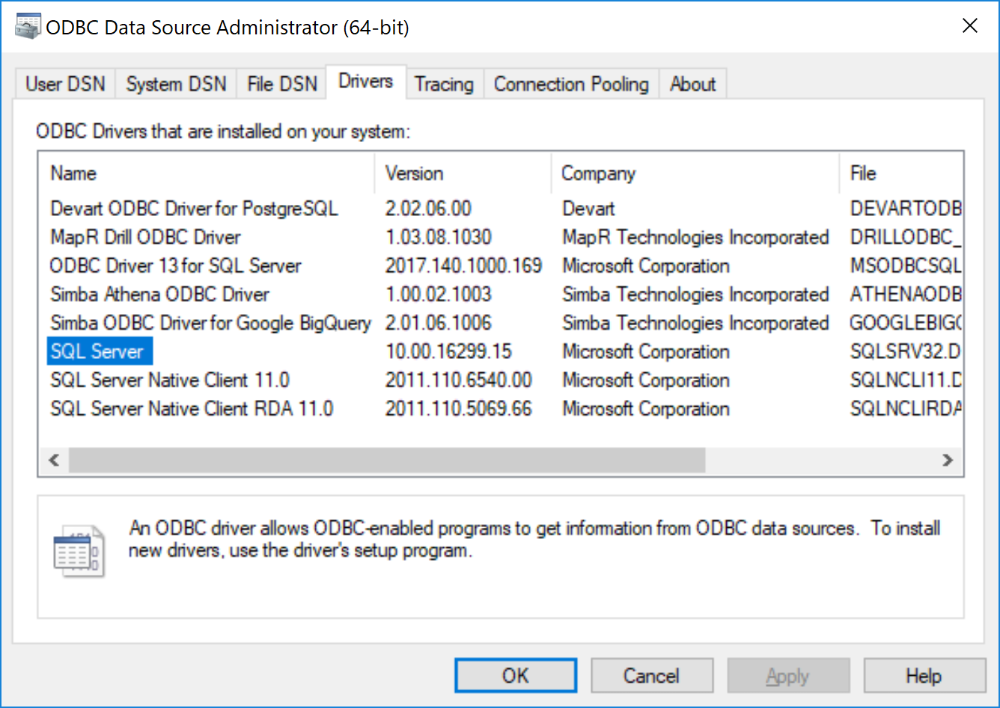
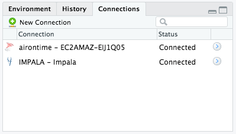

```{r setup, include=FALSE}
# Install and load pacman (library management package)
if (!require("pacman")) install.packages("pacman")

# Install and load required packages from CRAN ---------------------------------
pacman::p_load(here,knitr,bookdown,odbc,dplyr,dbplyr)
# Install packages from github
pacman::p_load_gh("hadley/emo")

# Configure knitr options
knitr::opts_chunk$set(echo = FALSE)
```

## What is a Relational Database?
From Wikipedia: _A **relational database** is a digital database based on the relational model of data, as proposed by E. F. Codd in 1970. A software system used to maintain relational databases is a relational database management system (RDBMS). Virtually all relational database systems use SQL (Structured Query Language) for querying and maintaining the database._

## What is a Relational Database?
From Wikipedia: _**Relational model** organizes data into one or more tables (or "relations") of columns and rows, with a unique key identifying each row. Rows are called records; columns are called attributes. Generally, each table/relation represents one "entity type" (such as customer or product). The rows represent instances of that type of entity (such as "Lee" or "chair") and the columns representing values attributed to that instance (such as address or price)._  

## Relational Database Management Systems (RDMS)  
- **MS Access**
- **MS SQL Server**
- **Oracle**
- SQLite
- MySQL
- PostgreSQL

Several others available at (http://db.rstudio.com/databases/).  

## Why put data in a database?
- Avoid static, flat files with multiple copies/versions
- Centralize data storage with access to many users simultaneously
- Improve data quality (i.e., referential integrity)
- Store large amounts of data  

_**But how to you access it once it's in there?!?**_ `r emo::ji("open_mouth")`

## Open Database Connectivity (**ODBC**)  



## Open Database Connectivity (**ODBC**)  

```{r,echo=T}
library(odbc)
# Show installed ODBC drivers
tibble(sort(unique(odbcListDrivers()[[1]])))
```

## Data Source Name (**DSN**)


## Data Source Name (**DSN**)

```{r, echo=T}
library(odbc)
# Show installed ODBC drivers
tibble(sort(unique(odbcListDataSources()[[1]])))
```  

## Data Source Name (**DSN**)  

Configure a DSN in code.

```{r, echo=T}
# Configure the connection
con <- dbConnect(odbc(), 
                 Driver = "SQL Server", 
                 Server = "161.55.235.187", 
                 Database = "ROV2", 
                 Trusted_Connection = "True")

# Show connection details
con

# Disconnect from database
dbDisconnect(con)
```  

## Accessing databases using R 


## Motivation for this presentation?

The materials in this presentation have been largely adapted from the Rstudio Webinar by Edgar Ruiz entitled: [Best practices for working with databases](https://www.rstudio.com/resources/videos/best-practices-for-working-with-databases-webinar/).

A great resource for tools and best practices when working with databases in R can be found here: [db.rstudio.com](http://db.rstudio.com/). 

## Inspiration for this talk
- Stay within your R workflow
- Use database engines (e.g., SQL Engine) to speed workflow by analyzing data in place
- Taking advantage of more intuitive [tidyverse](https://www.tidyverse.org/) tools (e.g., `dplyr`) and the pipe operator (`%>%`)
- Never have to learn SQL, thanks to `dbplyr` `r emo::ji("wink")`
- Encourage reproducible research by linking data to analysis

## Recent developments  
- `DBI` package is faster than the legacy `RODBC` package
- `dplyr` and `dbplyr` packages have a generalized SQL backend for talking to databases
- `dbplyr` package translates R code into database-specific variants
- `odbc` package standardizes database connections and is `DBI`-compliant 
- Rstudio IDE (>v1.1) now includes a **Connections** pane for connecting to, exploring, and viewing data in a variety of databases

## Connections pane in Rstudio

  

# Extras

## `r emo::ji("construction")` [Drivers on Mac](https://db.rstudio.com/best-practices/drivers/) `r emo::ji("construction")`
* Install homebrew
* Install UnixODBC (required for all)
    + `brew install unixodbc`
* Install common DB drivers (optional)
    + SQL Server ODBC Drivers (Free TDS)
    + `brew install freetds --with-unixodbc`
    + PostgreSQL ODBC ODBC Drivers
    + `brew install psqlodbc`
    + MySQL ODBC Drivers (and database)
    + `brew install mysql`
    + SQLite ODBC Drivers
    `brew install sqliteodbc` 